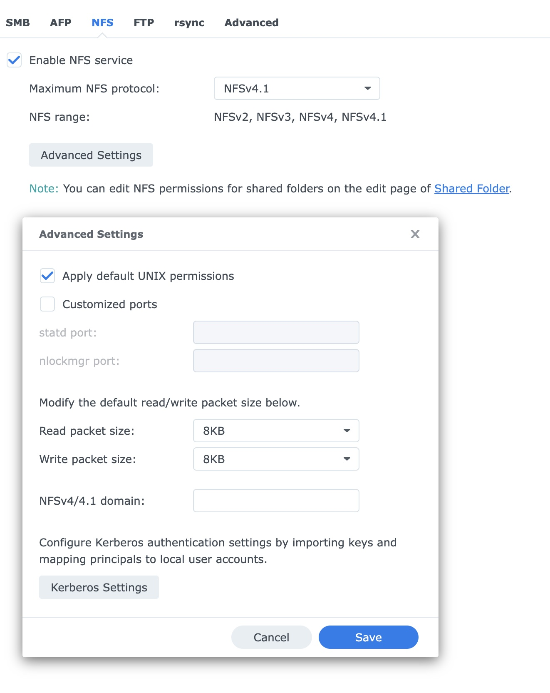
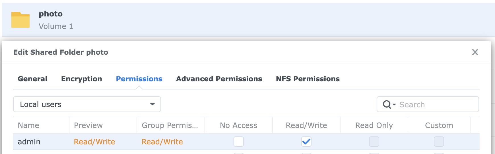

# Raspberry Pi slideshow 

This project is to create a photo frame driven by Raspberry Pi connected to an external 
generic monitor. The Python code reads in a file that lists photos to display.
The photos are read from a remote NAS on the same LAN via an NFS mounted folder.


WiFi or Ethernet config of the RPi is out of scope of this guide. Just configure networking
that you prefer and put it on the same LAN as the NAS that stores the photos.

## How to use the photo frame
On your mobile device open this in your browser to control the slideshow:
```
http://rpi:7654
```
If you see a photo that you would rather skip next time, out it on pause, go back with Prev
and mark that photo by its number. Next time this photo will be excluded.

The screen goes automatically dark at 22:00 and goes back on at 7:00 in the morning.
You can manually turn it on and off at any moment.

## Install required Python libraries
```
pip3 install pillow
pip3 install pygame
pip3 install flask
```
I might have forgotten some other libs, but you will see error and install what's needed. 

## Create target folder on RPi
```
mkdir ~/py-frame
cd ~/py-frame
```

Get the executable code:
```
curl -L raw.githubusercontent.com/zhukovin/py-frame/main/py_frame.py -o py_frame.py
curl -L raw.githubusercontent.com/zhukovin/py-frame/main/web_server.py -o web_server.py
```

## Mount NAS photo folder using NFS

### Enable and configure NFS on NAS

* Login to NAS web UI and navigate to `Control Panel - File Services - NFS`.
* Enable NFS service and select NFSv3 (it might work with up to v4.1, but I did not try).
* Keep Advanced Settings as they are



### Configure Shared Folder NFS Permissions

* Click Shared Folder on the NFS settings page.
* Right-click on `photo` folder, choose `Edit` and go to `NFS Permissions`.
* Create a rule:
  * Hostname or IP: 192.168.1.201 (also try using `rpi` host name) -
     this is your RPi's IP.
  * Privilege: Read only
  * Squash: Map all users to admin (admin must have access to `photo`; see below)
  * Security: sys
  * Enable asynchronous
  * The rest of the settings might be not needed, but I set them too. 


### Make sure `admin` can access the shared folder

Since all incoming user names (like `pi`) are mapped/squashed to nasus' `admin`,
the `admin` must have access to photo folder:



### Mount NAS NFS on RPi

#### First, try it manually
On `RPi` add NAS to hosts to force IPv4 resolution. For some reason,
`host nasus` on my RPi resolves to IPv6 only that does not works with NFS v3.
```
sudo nano /etc/hosts
```
Add:
```
192.168.1.189   nasus
```
Make sure the mountpoint exists:
```
sudo mkdir -p /mnt/nasus/photo
```
On `RPi` run:
```
sudo mount -t nfs -o vers=3 nasus:/volume1/photo /mnt/nasus/photo
```
Check that NFS  mount works and files are visible:
```
ls /mnt/nasus/photo
```
You should see photo's content and no errors.

#### Auto-mount NAS photo folder on RPi boot
Create a systemd service that waits for network + NAS, then mounts:
```
sudo nano /etc/systemd/system/nasus-photo-mount.service
```
Paste this:
```
[Unit]
Description=Mount NAS photo share after network is ready
After=network.target
Wants=network.target

[Service]
Type=oneshot

# Wait for a default route AND NAS to respond, then mount.
# Retries for ~5 minutes.
ExecStartPre=/bin/sh -c '\
  for i in $(seq 1 300); do \
    ip route | grep -q "^default" || { sleep 1; continue; }; \
    ping -4 -c1 -W1 192.168.1.189 >/dev/null 2>&1 && exit 0; \
    sleep 1; \
  done; \
  exit 1'

# Don’t remount if already mounted
ExecStart=/bin/sh -c 'mountpoint -q /mnt/nasus/photo || /bin/mount -t nfs -o vers=3,_netdev,noatime,nolock,tcp,soft,timeo=50,retrans=2 nasus:/volume1/photo /mnt/nasus/photo'

RemainAfterExit=yes

# If NAS wasn’t ready in time, keep retrying in the background after boot
Restart=on-failure
RestartSec=10

[Install]
WantedBy=multi-user.target
```
Enable it:
```
sudo systemctl daemon-reload
sudo systemctl enable --now nasus-photo-mount.service
```
Check:
```
systemctl status nasus-photo-mount.service
mount | grep /mnt/nasus/photo || true
ls /mnt/nasus/photo
```

Reboot RPi and check if you can still list photo files.

After reboot run this for diagnostics:
```
systemctl status nasus-photo-mount.service
journalctl -u nasus-photo-mount.service -b --no-pager
mount | grep /mnt/nasus/photo || true
```

### Link mounted NAS folder to the target folder

The photos are listed as relative paths starting with `nasus/photo/...` in
both `photo.xxx.list` and `exclusions.txt`. This means that we need to map `nasus`
folder inside the target folder.

```
ln -s /mnt/nasus ~/py-frame/nasus
```

Check that it is mapped correctly:

```
ls -l ~/py-frame
```

You should see:
```
lrwxrwxrwx 1 pi pi      10 Dec 12 16:13 nasus -> /mnt/nasus
```

Check that photos are accessible:
```
ls -l ~/py-frame/nasus/photo
```

You should see something like:
```
total 1264
drwxrwxrwx  33 1026 users   4096 Mar 16  2023  2002
drwxrwxrwx 133 1026 users  12288 Dec  7  2024  2003
drwxrwxrwx 105 1026 users   4096 May 18  2022  2004
drwxrwxrwx  69 1026 users   4096 Mar 16  2023  2005
```

## Make a list of photos to display
This configuration uses relative paths, but absolute paths might be used as well.
Just be mindful about paths recorded in exclusions.txt if you decide to change
how you list the files (old paths might not work and might need migration).

Improvise from here:
```
find nasus/photo/Camera\ Media/Camera\ Alexey -type f \( -iname '*.jpg' -o -iname '*.jpeg' \) >photo.alex.list
```
or
```
ls nasus/photo/Camera\ Media/Camera\ Irina/20{10,11,12,13,14,15,16,17}/*.{jpg,JPG,jpeg,JPEG} > photo.irina.list
ls nasus/photo/Camera\ Media/Camera\ Irina/20{18,19,20,21,22,23,24,25}/*.{jpg,JPG,jpeg,JPEG} >> photo.irina.list
```

## Make slideshow start on RPi boot

### Step 1
Create file py-frame.service:

```
sudo nano /etc/systemd/system/py-frame.service
```

with this content:

```
[Unit]
Description=Raspberry Pi Photo Frame Slideshow (console)
After=network.target local-fs.target
Conflicts=getty@tty1.service

[Service]
Type=simple
User=pi
WorkingDirectory=/home/pi/py-frame
ExecStart=/usr/bin/python /home/pi/py-frame/py_frame.py /home/pi/py-frame/photo.irina.list

# Bind the service to the main console (tty1)
StandardInput=tty
StandardOutput=tty
StandardError=journal
TTYPath=/dev/tty1
TTYReset=yes
TTYVHangup=yes

# Tell SDL/pygame to use the framebuffer
Environment=SDL_VIDEODRIVER=fbcon
Environment=SDL_FBDEV=/dev/fb0
Environment=SDL_NOMOUSE=1

Restart=always
RestartSec=5

[Install]
WantedBy=multi-user.target
```

### Step 2
Disable TTY1:

```
sudo systemctl disable getty@tty1.service
```

### Step 3
```
sudo systemctl enable py-frame.service
```
Reboot to check if slideshow starts on boot.

```
reboot
```

### Useful commands
After changing `py-frame.service` reload it:
```
sudo systemctl daemon-reload
```

To start/stop the service:
```
sudo systemctl start py-frame.service
sudo systemctl stop  py-frame.service
```

Get status:
```
sudo systemctl status py-frame.service --no-pager
```

# Troubleshooting

```
dmesg -T | tail -n 100
watch -n 5 free -h
pgrep python
vcgencmd measure_volts
vcgencmd measure_temp
stress --cpu 4 --timeout 3000
hostname -I
arp -a
ifconfig getifaddr wlan0
rfkill list
sudo rfkill unblock all
systemctl status mnt-nasus-photo.mount
journalctl -u mnt-nasus-photo.mount -b
```
Enable SSH on RPi:
```
sudo raspi-config
```

Measure file download speed:
```
dd if=~/nasus/photo/2020/VID_20200120_083451.mp4 of=/dev/null bs=4M status=progress
```
